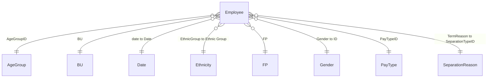

# Power BI Data Model — Human Resources Sample PBIX.pbix

Content matches the PBIX model (verified against pbixray relationships).

## Summary

- Source PBIX: `Human Resources Sample PBIX.pbix`
- Business tables: **9**
- Internal auto-date tables: **6**
- Relationships: **8**

## ER diagram

Visual ER diagram is embedded in **`DATA_MODEL.pdf`** (download and zoom). Mermaid below uses the same joins (`}o--||` = many-to-one, Power BI From→To).



## How to read

1. **ER first** — boxes = tables; lines = PBIX relationships. Prefer **`DATA_MODEL.pdf`** (download and zoom).
2. **`*`** = many / FK side (Power BI *FromTable*). **`1`** = one / PK side (*ToTable*).
3. Edge label = join column(s). **Inactive** = `IsActive=false` in the model.
4. Checklist sections below repeat the same joins for validation.
5. Column catalog marks PK/FK. `LocalDateTable_*` are auto-date helpers, not business joins.

## 1) Relationship flow

| # | Many side | FK | → | One side | PK | Card | Filter | Active |
|---|-----------|----|---|----------|----|------|--------|--------|
| 1 | `Employee` | `AgeGroupID` | → | `AgeGroup` | `AgeGroupID` | M:1 | Single | True |
| 2 | `Employee` | `BU` | → | `BU` | `BU` | M:1 | Single | True |
| 3 | `Employee` | `date` | → | `Date` | `Date` | M:1 | Single | True |
| 4 | `Employee` | `EthnicGroup` | → | `Ethnicity` | `Ethnic Group` | M:1 | Single | True |
| 5 | `Employee` | `FP` | → | `FP` | `FP` | M:1 | Single | True |
| 6 | `Employee` | `Gender` | → | `Gender` | `ID` | M:1 | Single | True |
| 7 | `Employee` | `PayTypeID` | → | `PayType` | `PayTypeID` | M:1 | Single | True |
| 8 | `Employee` | `TermReason` | → | `SeparationReason` | `SeparationTypeID` | M:1 | Single | True |

### Flow (plain text)

```
 1. Employee.AgeGroupID  -->  AgeGroup.AgeGroupID   (M:1, Single, ACTIVE)
 2. Employee.BU  -->  BU.BU   (M:1, Single, ACTIVE)
 3. Employee.date  -->  Date.Date   (M:1, Single, ACTIVE)
 4. Employee.EthnicGroup  -->  Ethnicity.Ethnic Group   (M:1, Single, ACTIVE)
 5. Employee.FP  -->  FP.FP   (M:1, Single, ACTIVE)
 6. Employee.Gender  -->  Gender.ID   (M:1, Single, ACTIVE)
 7. Employee.PayTypeID  -->  PayType.PayTypeID   (M:1, Single, ACTIVE)
 8. Employee.TermReason  -->  SeparationReason.SeparationTypeID   (M:1, Single, ACTIVE)
```

## 2) Schema layers (left → right)

- **Layer 0:** `AgeGroup` (dim), `BU` (dim), `Date` (dim), `Ethnicity` (dim), `FP` (dim), `Gender` (dim), `PayType` (dim), `SeparationReason` (dim)
- **Layer 1:** `Employee` (fact)

## NOTE — Internal tables

`LocalDateTable_*` / `DateTableTemplate_*` are Power BI auto date helpers. Usually **not** in business relationships.

| Internal table | Used for |
|----------------|----------|
| `DateTableTemplate_92fd358c-bb4c-4d52-9f5b-e9a59dc2315d` | `PBI auto-date TEMPLATE (not tied to a business column)` |
| `LocalDateTable_6f19fed3-1fc0-4f7a-878d-34aca93d6782` | `Date[Date]` |
| `LocalDateTable_c04ce649-6e25-466f-9bbc-faabfec0fe29` | `Employee[HireDate]` |
| `LocalDateTable_c9dde99e-7ac1-4e8e-a5f2-c5ffc41d9cac` | `Date[MonthEndDate]` |
| `LocalDateTable_cc28ef26-f63a-4bc3-b357-93ab34cd6d9b` | `Employee[TermDate]` |
| `LocalDateTable_d2ea5b26-668d-4c17-b228-695669b066a6` | `Date[MonthStartDate]` |

## 3) Business tables — columns

### `AgeGroup` (dim)
- Columns: 2

- `AgeGroupID` _PK_ — Int64
- `AgeGroup` — string

### `BU` (dim)
- Columns: 4

- `BU` _PK_ — string
- `RegionSeq` — string
- `VP` — string
- `Region` _CALC_ — string

### `Date` (dim)
- Columns: 12

- `Date` _PK_ — datetime64[ns]
- `Month` — string
- `MonthNumber` — Int64
- `Period` — string
- `PeriodNumber` — Int64
- `Qtr` — Int64
- `QtrNumber` — string
- `Year` — Int64
- `Day` — Int64
- `MonthStartDate` — datetime64[ns]
- `MonthEndDate` — datetime64[ns]
- `MonthIncrementNumber` _CALC_ — Int64

### `Employee` (fact)
- Columns: 16

- `date` _FK_ — datetime64[ns]
- `EmplID` — Int64
- `Gender` _FK_ — string
- `Age` — Int64
- `EthnicGroup` _FK_ — string
- `FP` _FK_ — string
- `TermDate` — datetime64[ns]
- `isNewHire` _CALC_ — Int64
- `BU` _FK_ — string
- `HireDate` — datetime64[ns]
- `PayTypeID` _FK_ — string
- `TermReason` _FK_ — string
- `AgeGroupID` _FK,CALC_ — Int64
- `TenureDays` _CALC_ — Float64
- `TenureMonths` _CALC_ — Int64
- `BadHires` _CALC_ — Float64

### `Ethnicity` (dim)
- Columns: 2

- `Ethnic Group` _PK_ — string
- `Ethnicity` — string

### `FP` (dim)
- Columns: 2

- `FP` _PK_ — string
- `FPDesc` — string

### `Gender` (dim)
- Columns: 3

- `ID` _PK_ — string
- `Gender` — string
- `Sort` — Int64

### `PayType` (dim)
- Columns: 2

- `PayTypeID` _PK_ — string
- `PayType` — string

### `SeparationReason` (dim)
- Columns: 2

- `SeparationTypeID` _PK_ — string
- `SeparationReason` — string


## 4) Internal tables — columns

### `DateTableTemplate_92fd358c-bb4c-4d52-9f5b-e9a59dc2315d`
- **Used for:** `PBI auto-date TEMPLATE (not tied to a business column)`

- `Date`
- `Year` _CALC_
- `MonthNo` _CALC_
- `Month` _CALC_
- `QuarterNo` _CALC_
- `Quarter` _CALC_
- `Day` _CALC_

### `LocalDateTable_6f19fed3-1fc0-4f7a-878d-34aca93d6782`
- **Used for:** `Date[Date]`

- `Date`
- `Year` _CALC_
- `MonthNo` _CALC_
- `Month` _CALC_
- `QuarterNo` _CALC_
- `Quarter` _CALC_
- `Day` _CALC_

### `LocalDateTable_c04ce649-6e25-466f-9bbc-faabfec0fe29`
- **Used for:** `Employee[HireDate]`

- `Date`
- `Year` _CALC_
- `MonthNo` _CALC_
- `Month` _CALC_
- `QuarterNo` _CALC_
- `Quarter` _CALC_
- `Day` _CALC_

### `LocalDateTable_c9dde99e-7ac1-4e8e-a5f2-c5ffc41d9cac`
- **Used for:** `Date[MonthEndDate]`

- `Date`
- `Year` _CALC_
- `MonthNo` _CALC_
- `Month` _CALC_
- `QuarterNo` _CALC_
- `Quarter` _CALC_
- `Day` _CALC_

### `LocalDateTable_cc28ef26-f63a-4bc3-b357-93ab34cd6d9b`
- **Used for:** `Employee[TermDate]`

- `Date`
- `Year` _CALC_
- `MonthNo` _CALC_
- `Month` _CALC_
- `QuarterNo` _CALC_
- `Quarter` _CALC_
- `Day` _CALC_

### `LocalDateTable_d2ea5b26-668d-4c17-b228-695669b066a6`
- **Used for:** `Date[MonthStartDate]`

- `Date`
- `Year` _CALC_
- `MonthNo` _CALC_
- `Month` _CALC_
- `QuarterNo` _CALC_
- `Quarter` _CALC_
- `Day` _CALC_

See also: `DATA_MODEL.pdf` (primary — download and zoom).
