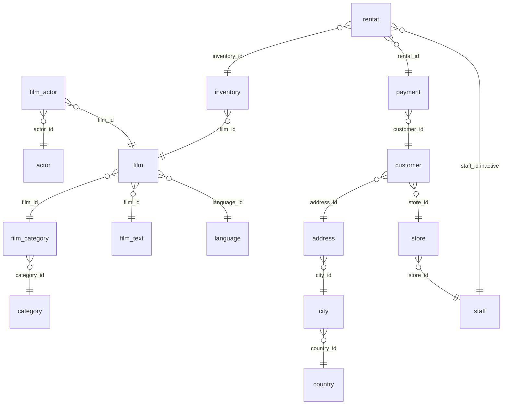

# Power BI Data Model — movie_rental_analysis.pbix

Content matches the PBIX model (verified against pbixray relationships).

## Summary

- Source PBIX: `movie_rental_analysis.pbix`
- Business tables: **16**
- Internal auto-date tables: **20**
- Relationships: **16**

## ER diagram

Visual ER diagram is embedded in **`DATA_MODEL.pdf`** (download and zoom). Mermaid below uses the same joins (`}o--||` = many-to-one, Power BI From→To).



## How to read

1. **ER first** — boxes = tables; lines = PBIX relationships. Prefer **`DATA_MODEL.pdf`** (download and zoom).
2. **`*`** = many / FK side (Power BI *FromTable*). **`1`** = one / PK side (*ToTable*).
3. Edge label = join column(s). **Inactive** = `IsActive=false` in the model.
4. Checklist sections below repeat the same joins for validation.
5. Column catalog marks PK/FK. `LocalDateTable_*` are auto-date helpers, not business joins.

## 1) Relationship flow

| # | Many side | FK | → | One side | PK | Card | Filter | Active |
|---|-----------|----|---|----------|----|------|--------|--------|
| 1 | `address` | `city_id` | → | `city` | `city_id` | M:1 | Both | True |
| 2 | `city` | `country_id` | → | `country` | `country_id` | M:1 | Single | True |
| 3 | `customer` | `address_id` | → | `address` | `address_id` | M:1 | Both | True |
| 4 | `customer` | `store_id` | → | `store` | `store_id` | M:1 | Single | True |
| 5 | `film` | `film_id` | → | `film_category` | `film_id` | M:1 | Single | True |
| 6 | `film` | `film_id` | → | `film_text` | `film_id` | M:1 | Single | True |
| 7 | `film` | `language_id` | → | `language` | `language_id` | M:1 | Single | True |
| 8 | `film_actor` | `actor_id` | → | `actor` | `actor_id` | M:1 | Single | True |
| 9 | `film_actor` | `film_id` | → | `film` | `film_id` | M:1 | Both | True |
| 10 | `film_category` | `category_id` | → | `category` | `category_id` | M:1 | Single | True |
| 11 | `inventory` | `film_id` | → | `film` | `film_id` | M:1 | Both | True |
| 12 | `payment` | `customer_id` | → | `customer` | `customer_id` | M:1 | Both | True |
| 13 | `rentat` | `inventory_id` | → | `inventory` | `inventory_id` | M:1 | Both | True |
| 14 | `rentat` | `rental_id` | → | `payment` | `rental_id` | M:1 | Both | True |
| 15 | `store` | `store_id` | → | `staff` | `store_id` | M:1 | Single | True |
| 16 | `rentat` | `staff_id` | → | `staff` | `staff_id` | M:1 | Single | False |

### Flow (plain text)

```
 1. address.city_id  -->  city.city_id   (M:1, Both, ACTIVE)
 2. city.country_id  -->  country.country_id   (M:1, Single, ACTIVE)
 3. customer.address_id  -->  address.address_id   (M:1, Both, ACTIVE)
 4. customer.store_id  -->  store.store_id   (M:1, Single, ACTIVE)
 5. film.film_id  -->  film_category.film_id   (M:1, Single, ACTIVE)
 6. film.film_id  -->  film_text.film_id   (M:1, Single, ACTIVE)
 7. film.language_id  -->  language.language_id   (M:1, Single, ACTIVE)
 8. film_actor.actor_id  -->  actor.actor_id   (M:1, Single, ACTIVE)
 9. film_actor.film_id  -->  film.film_id   (M:1, Both, ACTIVE)
10. film_category.category_id  -->  category.category_id   (M:1, Single, ACTIVE)
11. inventory.film_id  -->  film.film_id   (M:1, Both, ACTIVE)
12. payment.customer_id  -->  customer.customer_id   (M:1, Both, ACTIVE)
13. rentat.inventory_id  -->  inventory.inventory_id   (M:1, Both, ACTIVE)
14. rentat.rental_id  -->  payment.rental_id   (M:1, Both, ACTIVE)
15. store.store_id  -->  staff.store_id   (M:1, Single, ACTIVE)
16. rentat.staff_id  -->  staff.staff_id   (M:1, Single, INACTIVE)
```

## 2) Schema layers (left → right)

- **Layer 0:** `actor` (dim), `category` (dim), `country` (dim), `film_text` (dim), `language` (dim), `staff` (dim)
- **Layer 1:** `city` (fact), `film_category` (fact), `store` (fact)
- **Layer 2:** `address` (fact), `film` (bridge)
- **Layer 3:** `customer` (bridge), `film_actor` (fact), `inventory` (fact)
- **Layer 4:** `payment` (fact)
- **Layer 5:** `rentat` (fact)

## NOTE — Internal tables

`LocalDateTable_*` / `DateTableTemplate_*` are Power BI auto date helpers. Usually **not** in business relationships.

| Internal table | Used for |
|----------------|----------|
| `DateTableTemplate_a2d2931e-28fc-49d4-8f86-8eba292beccb` | `PBI auto-date TEMPLATE (not tied to a business column)` |
| `LocalDateTable_2da133f1-f68d-4b4b-8ac9-f0599639b604` | `actor[last_update]` |
| `LocalDateTable_4239b3b1-3dd6-4664-9851-e18de09a0567` | `payment[last_update]` |
| `LocalDateTable_50a2d13e-fe1d-4c9d-a15d-eb4645f9255d` | `country[last_update]` |
| `LocalDateTable_5bb36e84-426a-46fa-a13a-582ef5d6dc26` | `payment[payment_date]` |
| `LocalDateTable_6086d83f-4701-4a3c-bc1d-3559af3b0892` | `staff[last_update]` |
| `LocalDateTable_6a8a1b8a-08db-41d5-8644-a433e0a4df0b` | `customer[create_date]` |
| `LocalDateTable_6f8b0d1f-465a-4e1d-aeb7-5159a1a4f632` | `film_category[last_update]` |
| `LocalDateTable_70e91751-9ad0-4624-a9f6-239b895d4c07` | `rentat[rental_date]` |
| `LocalDateTable_87276294-e462-4311-ae3b-ed5eff935d96` | `address[last_update]` |
| `LocalDateTable_874aff1d-fcfb-4b81-ac6e-ffb89b0ffde4` | `language[last_update]` |
| `LocalDateTable_8765a386-0fbd-4b49-b6b6-3081c9e155ce` | `film[last_update]` |
| `LocalDateTable_9aade881-448f-4a31-ad80-a5a3f46b3dae` | `store[last_update]` |
| `LocalDateTable_9f8673ee-bb2e-4fbb-bb1c-ec9378110b48` | `customer[last_update]` |
| `LocalDateTable_a8f0fb53-b463-4fac-b8e7-a889be094bc7` | `rentat[return_date]` |
| `LocalDateTable_c928e018-84d6-4ce3-ae3b-63bafef00319` | `film_actor[last_update]` |
| `LocalDateTable_d0d09aee-878f-400a-9b99-c55fb13a7bb3` | `rentat[last_update]` |
| `LocalDateTable_e54b6b64-66e9-4425-bfb5-60e11fa998ee` | `city[last_update]` |
| `LocalDateTable_ee80cc38-2934-4181-972c-f0b7d5752b22` | `category[last_update]` |
| `LocalDateTable_fc9173f0-2a64-4402-a7d0-c24da1027bc5` | `inventory[last_update]` |

## 3) Business tables — columns

### `actor` (dim)
- Columns: 4

- `actor_id` _PK_ — Int64
- `first_name` — string
- `last_name` — string
- `last_update` — datetime64[ns]

### `address` (fact)
- Columns: 9

- `address_id` _PK_ — Int64
- `address` — string
- `address2` — string
- `district` — string
- `city_id` _FK_ — Int64
- `postal_code` — Int64
- `phone` — Int64
- `location` — string
- `last_update` — datetime64[ns]

### `category` (dim)
- Columns: 3

- `category_id` _PK_ — Int64
- `name` — string
- `last_update` — datetime64[ns]

### `city` (fact)
- Columns: 4

- `city_id` _PK_ — Int64
- `city` — string
- `country_id` _FK_ — Int64
- `last_update` — datetime64[ns]

### `country` (dim)
- Columns: 3

- `country_id` _PK_ — Int64
- `country` — string
- `last_update` — datetime64[ns]

### `customer` (bridge)
- Columns: 10

- `customer_id` _PK_ — Int64
- `store_id` _FK_ — Int64
- `first_name` — string
- `last_name` — string
- `email` — string
- `address_id` _FK_ — Int64
- `active` — Int64
- `create_date` — datetime64[ns]
- `last_update` — datetime64[ns]
- `Employment Duration` _CALC_ — Int64

### `film` (bridge)
- Columns: 13

- `film_id` _PK,FK_ — Int64
- `title` — string
- `description` — string
- `release_year` — Int64
- `language_id` _FK_ — Int64
- `original_language_id` — Int64
- `rental_duration` — Int64
- `rental_rate` — Float64
- `length` — Int64
- `replacement_cost` — Float64
- `rating` — string
- `special_features` — string
- `last_update` — datetime64[ns]

### `film_actor` (fact)
- Columns: 3

- `actor_id` _FK_ — Int64
- `film_id` _FK_ — Int64
- `last_update` — datetime64[ns]

### `film_category` (fact)
- Columns: 3

- `film_id` _PK_ — Int64
- `category_id` _FK_ — Int64
- `last_update` — datetime64[ns]

### `film_text` (dim)
- Columns: 3

- `film_id` _PK_ — Int64
- `title` — string
- `description` — string

### `inventory` (fact)
- Columns: 4

- `inventory_id` _PK_ — Int64
- `film_id` _FK_ — Int64
- `store_id` — Int64
- `last_update` — datetime64[ns]

### `language` (dim)
- Columns: 3

- `language_id` _PK_ — Int64
- `name` — string
- `last_update` — datetime64[ns]

### `payment` (fact)
- Columns: 7

- `payment_id` — Int64
- `customer_id` _FK_ — Int64
- `staff_id` — Int64
- `rental_id` _PK_ — Int64
- `amount` — Float64
- `payment_date` — datetime64[ns]
- `last_update` — datetime64[ns]

### `rentat` (fact)
- Columns: 7

- `rental_id` _FK_ — Int64
- `rental_date` — datetime64[ns]
- `inventory_id` _FK_ — Int64
- `customer_id` — Int64
- `return_date` — datetime64[ns]
- `staff_id` _FK_ — Int64
- `last_update` — datetime64[ns]

### `staff` (dim)
- Columns: 11

- `staff_id` _PK_ — Int64
- `first_name` — string
- `last_name` — string
- `address_id` — Int64
- `picture` — string
- `email` — string
- `store_id` _PK_ — Int64
- `active` — Int64
- `username` — string
- `password` — string
- `last_update` — datetime64[ns]

### `store` (fact)
- Columns: 4

- `store_id` _PK,FK_ — Int64
- `manager_staff_id` — Int64
- `address_id` — Int64
- `last_update` — datetime64[ns]


## 4) Internal tables — columns

### `DateTableTemplate_a2d2931e-28fc-49d4-8f86-8eba292beccb`
- **Used for:** `PBI auto-date TEMPLATE (not tied to a business column)`

- `Date`
- `Year` _CALC_
- `MonthNo` _CALC_
- `Month` _CALC_
- `QuarterNo` _CALC_
- `Quarter` _CALC_
- `Day` _CALC_

### `LocalDateTable_2da133f1-f68d-4b4b-8ac9-f0599639b604`
- **Used for:** `actor[last_update]`

- `Date`
- `Year` _CALC_
- `MonthNo` _CALC_
- `Month` _CALC_
- `QuarterNo` _CALC_
- `Quarter` _CALC_
- `Day` _CALC_

### `LocalDateTable_4239b3b1-3dd6-4664-9851-e18de09a0567`
- **Used for:** `payment[last_update]`

- `Date`
- `Year` _CALC_
- `MonthNo` _CALC_
- `Month` _CALC_
- `QuarterNo` _CALC_
- `Quarter` _CALC_
- `Day` _CALC_

### `LocalDateTable_50a2d13e-fe1d-4c9d-a15d-eb4645f9255d`
- **Used for:** `country[last_update]`

- `Date`
- `Year` _CALC_
- `MonthNo` _CALC_
- `Month` _CALC_
- `QuarterNo` _CALC_
- `Quarter` _CALC_
- `Day` _CALC_

### `LocalDateTable_5bb36e84-426a-46fa-a13a-582ef5d6dc26`
- **Used for:** `payment[payment_date]`

- `Date`
- `Year` _CALC_
- `MonthNo` _CALC_
- `Month` _CALC_
- `QuarterNo` _CALC_
- `Quarter` _CALC_
- `Day` _CALC_

### `LocalDateTable_6086d83f-4701-4a3c-bc1d-3559af3b0892`
- **Used for:** `staff[last_update]`

- `Date`
- `Year` _CALC_
- `MonthNo` _CALC_
- `Month` _CALC_
- `QuarterNo` _CALC_
- `Quarter` _CALC_
- `Day` _CALC_

### `LocalDateTable_6a8a1b8a-08db-41d5-8644-a433e0a4df0b`
- **Used for:** `customer[create_date]`

- `Date`
- `Year` _CALC_
- `MonthNo` _CALC_
- `Month` _CALC_
- `QuarterNo` _CALC_
- `Quarter` _CALC_
- `Day` _CALC_

### `LocalDateTable_6f8b0d1f-465a-4e1d-aeb7-5159a1a4f632`
- **Used for:** `film_category[last_update]`

- `Date`
- `Year` _CALC_
- `MonthNo` _CALC_
- `Month` _CALC_
- `QuarterNo` _CALC_
- `Quarter` _CALC_
- `Day` _CALC_

### `LocalDateTable_70e91751-9ad0-4624-a9f6-239b895d4c07`
- **Used for:** `rentat[rental_date]`

- `Date`
- `Year` _CALC_
- `MonthNo` _CALC_
- `Month` _CALC_
- `QuarterNo` _CALC_
- `Quarter` _CALC_
- `Day` _CALC_

### `LocalDateTable_87276294-e462-4311-ae3b-ed5eff935d96`
- **Used for:** `address[last_update]`

- `Date`
- `Year` _CALC_
- `MonthNo` _CALC_
- `Month` _CALC_
- `QuarterNo` _CALC_
- `Quarter` _CALC_
- `Day` _CALC_

### `LocalDateTable_874aff1d-fcfb-4b81-ac6e-ffb89b0ffde4`
- **Used for:** `language[last_update]`

- `Date`
- `Year` _CALC_
- `MonthNo` _CALC_
- `Month` _CALC_
- `QuarterNo` _CALC_
- `Quarter` _CALC_
- `Day` _CALC_

### `LocalDateTable_8765a386-0fbd-4b49-b6b6-3081c9e155ce`
- **Used for:** `film[last_update]`

- `Date`
- `Year` _CALC_
- `MonthNo` _CALC_
- `Month` _CALC_
- `QuarterNo` _CALC_
- `Quarter` _CALC_
- `Day` _CALC_

### `LocalDateTable_9aade881-448f-4a31-ad80-a5a3f46b3dae`
- **Used for:** `store[last_update]`

- `Date`
- `Year` _CALC_
- `MonthNo` _CALC_
- `Month` _CALC_
- `QuarterNo` _CALC_
- `Quarter` _CALC_
- `Day` _CALC_

### `LocalDateTable_9f8673ee-bb2e-4fbb-bb1c-ec9378110b48`
- **Used for:** `customer[last_update]`

- `Date`
- `Year` _CALC_
- `MonthNo` _CALC_
- `Month` _CALC_
- `QuarterNo` _CALC_
- `Quarter` _CALC_
- `Day` _CALC_

### `LocalDateTable_a8f0fb53-b463-4fac-b8e7-a889be094bc7`
- **Used for:** `rentat[return_date]`

- `Date`
- `Year` _CALC_
- `MonthNo` _CALC_
- `Month` _CALC_
- `QuarterNo` _CALC_
- `Quarter` _CALC_
- `Day` _CALC_

### `LocalDateTable_c928e018-84d6-4ce3-ae3b-63bafef00319`
- **Used for:** `film_actor[last_update]`

- `Date`
- `Year` _CALC_
- `MonthNo` _CALC_
- `Month` _CALC_
- `QuarterNo` _CALC_
- `Quarter` _CALC_
- `Day` _CALC_

### `LocalDateTable_d0d09aee-878f-400a-9b99-c55fb13a7bb3`
- **Used for:** `rentat[last_update]`

- `Date`
- `Year` _CALC_
- `MonthNo` _CALC_
- `Month` _CALC_
- `QuarterNo` _CALC_
- `Quarter` _CALC_
- `Day` _CALC_

### `LocalDateTable_e54b6b64-66e9-4425-bfb5-60e11fa998ee`
- **Used for:** `city[last_update]`

- `Date`
- `Year` _CALC_
- `MonthNo` _CALC_
- `Month` _CALC_
- `QuarterNo` _CALC_
- `Quarter` _CALC_
- `Day` _CALC_

### `LocalDateTable_ee80cc38-2934-4181-972c-f0b7d5752b22`
- **Used for:** `category[last_update]`

- `Date`
- `Year` _CALC_
- `MonthNo` _CALC_
- `Month` _CALC_
- `QuarterNo` _CALC_
- `Quarter` _CALC_
- `Day` _CALC_

### `LocalDateTable_fc9173f0-2a64-4402-a7d0-c24da1027bc5`
- **Used for:** `inventory[last_update]`

- `Date`
- `Year` _CALC_
- `MonthNo` _CALC_
- `Month` _CALC_
- `QuarterNo` _CALC_
- `Quarter` _CALC_
- `Day` _CALC_

See also: `DATA_MODEL.pdf` (primary — download and zoom).
