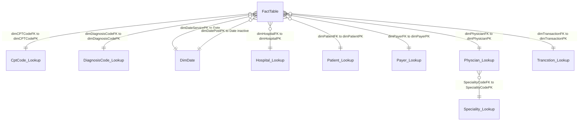

# Power BI Data Model — dashboards.pbix

Content matches the PBIX model (verified against pbixray relationships).

## Summary

- Source PBIX: `dashboards.pbix`
- Business tables: **12**
- Internal auto-date tables: **6**
- Relationships: **10**

## ER diagram

Visual ER diagram is embedded in **`DATA_MODEL.pdf`** (download and zoom). Mermaid below uses the same joins (`}o--||` = many-to-one, Power BI From→To).



## How to read

1. **ER first** — boxes = tables; lines = PBIX relationships. Prefer **`DATA_MODEL.pdf`** (download and zoom).
2. **`*`** = many / FK side (Power BI *FromTable*). **`1`** = one / PK side (*ToTable*).
3. Edge label = join column(s). **Inactive** = `IsActive=false` in the model.
4. Checklist sections below repeat the same joins for validation.
5. Column catalog marks PK/FK. `LocalDateTable_*` are auto-date helpers, not business joins.

## 1) Relationship flow

| # | Many side | FK | → | One side | PK | Card | Filter | Active |
|---|-----------|----|---|----------|----|------|--------|--------|
| 1 | `FactTable` | `dimCPTCodeFK` | → | `CptCode_Lookup` | `dimCPTCodePK` | M:1 | Single | True |
| 2 | `FactTable` | `dimDiagnosisCodeFK` | → | `DiagnosisCode_Lookup` | `dimDiagnosisCodePK` | M:1 | Single | True |
| 3 | `FactTable` | `dimDateServicePK` | → | `DimDate` | `Date` | M:1 | Single | True |
| 4 | `FactTable` | `dimHospitalFK` | → | `Hospital_Lookup` | `dimHospitalPK` | M:1 | Single | True |
| 5 | `FactTable` | `dimPatientFK` | → | `Patient_Lookup` | `dimPatientPK` | M:1 | Single | True |
| 6 | `FactTable` | `dimPayerFK` | → | `Payer_Lookup` | `dimPayerPK` | M:1 | Single | True |
| 7 | `FactTable` | `dimPhysicianFK` | → | `Physcian_Lookup` | `dimPhysicianPK` | M:1 | Both | True |
| 8 | `FactTable` | `dimTransactionFK` | → | `Trancstion_Lookup` | `dimTransactionPK` | M:1 | Single | True |
| 9 | `Physcian_Lookup` | `SpecialityCodeFK` | → | `Speciality_Lookup` | `SpecialityCodePK` | M:1 | Single | True |
| 10 | `FactTable` | `dimDatePostPK` | → | `DimDate` | `Date` | M:1 | Single | False |

### Flow (plain text)

```
 1. FactTable.dimCPTCodeFK  -->  CptCode_Lookup.dimCPTCodePK   (M:1, Single, ACTIVE)
 2. FactTable.dimDiagnosisCodeFK  -->  DiagnosisCode_Lookup.dimDiagnosisCodePK   (M:1, Single, ACTIVE)
 3. FactTable.dimDateServicePK  -->  DimDate.Date   (M:1, Single, ACTIVE)
 4. FactTable.dimHospitalFK  -->  Hospital_Lookup.dimHospitalPK   (M:1, Single, ACTIVE)
 5. FactTable.dimPatientFK  -->  Patient_Lookup.dimPatientPK   (M:1, Single, ACTIVE)
 6. FactTable.dimPayerFK  -->  Payer_Lookup.dimPayerPK   (M:1, Single, ACTIVE)
 7. FactTable.dimPhysicianFK  -->  Physcian_Lookup.dimPhysicianPK   (M:1, Both, ACTIVE)
 8. FactTable.dimTransactionFK  -->  Trancstion_Lookup.dimTransactionPK   (M:1, Single, ACTIVE)
 9. Physcian_Lookup.SpecialityCodeFK  -->  Speciality_Lookup.SpecialityCodePK   (M:1, Single, ACTIVE)
10. FactTable.dimDatePostPK  -->  DimDate.Date   (M:1, Single, INACTIVE)
```

## 2) Schema layers (left → right)

- **Layer 0:** `Adjustment factor (%)` (other), `BadDebtTable` (other), `CptCode_Lookup` (dim), `DiagnosisCode_Lookup` (dim), `DimDate` (dim), `Hospital_Lookup` (dim), `Patient_Lookup` (dim), `Payer_Lookup` (dim), `Speciality_Lookup` (dim), `Trancstion_Lookup` (dim)
- **Layer 1:** `Physcian_Lookup` (fact)
- **Layer 2:** `FactTable` (fact)

## NOTE — Internal tables

`LocalDateTable_*` / `DateTableTemplate_*` are Power BI auto date helpers. Usually **not** in business relationships.

| Internal table | Used for |
|----------------|----------|
| `DateTableTemplate_be97c3f8-f201-4a00-a952-d6592f333bdd` | `PBI auto-date TEMPLATE (not tied to a business column)` |
| `LocalDateTable_2c2a61ff-39c4-4f0c-97ac-a6a7efb97db4` | `DimDate[Start of Month]` |
| `LocalDateTable_39bba987-77ed-4008-8322-dd29e2cc2f25` | `DimDate[End of Month]` |
| `LocalDateTable_a249ec34-7878-4151-b4c2-6a7b636bf3c0` | `DimDate[Date]` |
| `LocalDateTable_d31a6fc7-dba3-4410-a53a-de9bb2d5b1c2` | `Patient_Lookup[DateOfBirth]` |
| `LocalDateTable_ef34a3ff-4085-4eda-a1df-b58a8db8be46` | `DimDate[MonthYear]` |

## 3) Business tables — columns

### `Adjustment factor (%)` (other)
- Columns: 1

- `Adjustment factor (%)` — Float64

### `BadDebtTable` (other)
- Columns: 4

- `dimTransactionPK` — Int64
- `TransactionType` — string
- `Transaction` — string
- `AdjustmentReason` — string

### `CptCode_Lookup` (dim)
- Columns: 4

- `dimCPTCodePK` _PK_ — Int64
- `CptCode` — string
- `CptDesc` — string
- `CptGrouping` — string

### `DiagnosisCode_Lookup` (dim)
- Columns: 4

- `dimDiagnosisCodePK` _PK_ — Int64
- `DiagnosisCode` — string
- `DiagnosisCodeDescription` — string
- `DiagnosisCodeGroup` — string

### `DimDate` (dim)
- Columns: 20

- `Date` _PK_ — datetime64[ns]
- `Year` — Int64
- `Month` — string
- `MonthPeriod` — Int64
- `MonthYear` — datetime64[ns]
- `Day` — Int64
- `DayName` — string
- `Start of Month` — datetime64[ns]
- `Day of Week` — Int64
- `Day Name` — string
- `Year.1` — Int64
- `Month.1` — Int64
- `End of Month` — datetime64[ns]
- `ShortDayName` _CALC_ — string
- `ShortDayName2` _CALC_ — string
- `DayOfWeek` _CALC_ — Int64
- `Weekend` _CALC_ — string
- `WeekNum` _CALC_ — Int64
- `Years` _CALC_ — Int64
- `Months` _CALC_ — Int64

### `FactTable` (fact)
- Columns: 25

- `FactTablePK` _PK_ — Int64
- `Check Dimension` — Int64
- `dimPatientFK` _FK_ — Int64
- `dimPhysicianFK` _FK_ — Int64
- `dimDateServicePK` _FK_ — datetime64[ns]
- `dimDatePostPK` _FK_ — datetime64[ns]
- `dimCPTCodeFK` _FK_ — Int64
- `dimPayerFK` _FK_ — Int64
- `dimTransactionFK` _FK_ — Int64
- `dimHospitalFK` _FK_ — Int64
- `PatientNumber` — Int64
- `dimDiagnosisCodeFK` _FK_ — Int64
- `CPTUnits` — Int64
- `Gross Expenses` — Float64
- `Adjustment` — Int64
- `Insurance_Payment` — Int64
- `Patient_Payment` — Float64
- `AR` — Float64
- `Dayoftheweek` _CALC_ — Int64
- `CPTUnitType` _CALC_ — string
- `TotalPayment` _CALC_ — Float64
- `PatientGender` _CALC_ — string
- `PatientEthinicity` _CALC_ — string
- `PatientCity` _CALC_ — string
- `RegionCode` _CALC_ — string

### `Hospital_Lookup` (dim)
- Columns: 3

- `dimHospitalPK` _PK_ — Int64
- `HospitalName` — string
- `IsHospitalNameLong` _CALC_ — string

### `Patient_Lookup` (dim)
- Columns: 34

- `dimPatientPK` _PK_ — Int64
- `PatientNumber` — Int64
- `FirstName` — string
- `LastName` — string
- `Email` — string
- `PatientGender` — string
- `PatientAge` — Int64
- `PatientHeight(in cms)` — Int64
- `Year of Birth` — Int64
- `Month` — Int64
- `Day` — Int64
- `BloodGroup` — string
- `Tobacco` — string
- `Alcohol` — string
- `Exercise` — string
- `Diet` — string
- `Ethinicity` — string
- `Zip Codes` — Int64
- `State Code` — string
- `City` — string
- `State` — string
- `Region` — string
- `DateOfBirth` _CALC_ — datetime64[ns]
- `MonthName` _CALC_ — string
- `ageofPatient` _CALC_ — Int64
- `PatientFullName` _CALC_ — string
- `Age>50` _CALC_ — string
- `Patient_AT` _CALC_ — bool
- `Patient_ATD` _CALC_ — bool
- `RegionCode` _CALC_ — string
- `Patient_!AT` _CALC_ — bool
- `fn` _CALC_ — string
- `PatientFullName_UPPER` _CALC_ — string
- `Rounded Age` _CALC_ — Int64

### `Payer_Lookup` (dim)
- Columns: 2

- `dimPayerPK` _PK_ — Int64
- `PayerName` — string

### `Physcian_Lookup` (fact)
- Columns: 5

- `dimPhysicianPK` _PK_ — Int64
- `ProviderNpi` — Int64
- `ProviderName` — string
- `SpecialityCodeFK` _FK_ — Int64
- `ProviderFTE` — Float64

### `Speciality_Lookup` (dim)
- Columns: 4

- `SpecialityCodePK` _PK_ — string
- `ProviderSpecialty` — string
- `SpecialityType` — string
- `SpecialityDesc` — string

### `Trancstion_Lookup` (dim)
- Columns: 4

- `dimTransactionPK` _PK_ — Int64
- `TransactionType` — string
- `Transaction` — string
- `AdjustmentReason` — string


## 4) Internal tables — columns

### `DateTableTemplate_be97c3f8-f201-4a00-a952-d6592f333bdd`
- **Used for:** `PBI auto-date TEMPLATE (not tied to a business column)`

- `Date`
- `Year` _CALC_
- `MonthNo` _CALC_
- `Month` _CALC_
- `QuarterNo` _CALC_
- `Quarter` _CALC_
- `Day` _CALC_

### `LocalDateTable_2c2a61ff-39c4-4f0c-97ac-a6a7efb97db4`
- **Used for:** `DimDate[Start of Month]`

- `Date`
- `Year` _CALC_
- `MonthNo` _CALC_
- `Month` _CALC_
- `QuarterNo` _CALC_
- `Quarter` _CALC_
- `Day` _CALC_

### `LocalDateTable_39bba987-77ed-4008-8322-dd29e2cc2f25`
- **Used for:** `DimDate[End of Month]`

- `Date`
- `Year` _CALC_
- `MonthNo` _CALC_
- `Month` _CALC_
- `QuarterNo` _CALC_
- `Quarter` _CALC_
- `Day` _CALC_

### `LocalDateTable_a249ec34-7878-4151-b4c2-6a7b636bf3c0`
- **Used for:** `DimDate[Date]`

- `Date`
- `Year` _CALC_
- `MonthNo` _CALC_
- `Month` _CALC_
- `QuarterNo` _CALC_
- `Quarter` _CALC_
- `Day` _CALC_

### `LocalDateTable_d31a6fc7-dba3-4410-a53a-de9bb2d5b1c2`
- **Used for:** `Patient_Lookup[DateOfBirth]`

- `Date`
- `Year` _CALC_
- `MonthNo` _CALC_
- `Month` _CALC_
- `QuarterNo` _CALC_
- `Quarter` _CALC_
- `Day` _CALC_

### `LocalDateTable_ef34a3ff-4085-4eda-a1df-b58a8db8be46`
- **Used for:** `DimDate[MonthYear]`

- `Date`
- `Year` _CALC_
- `MonthNo` _CALC_
- `Month` _CALC_
- `QuarterNo` _CALC_
- `Quarter` _CALC_
- `Day` _CALC_

See also: `DATA_MODEL.pdf` (primary — download and zoom).
